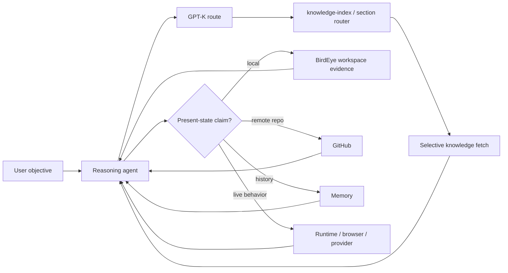
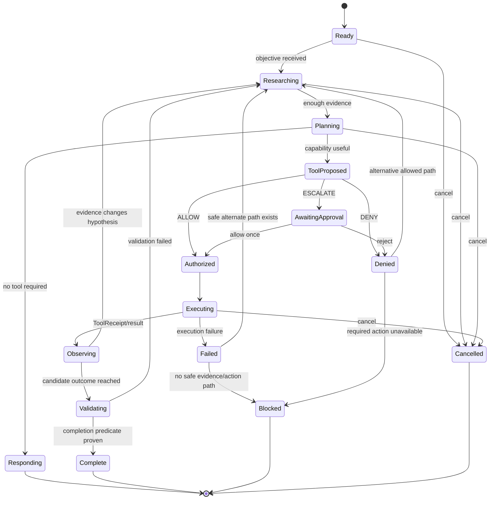
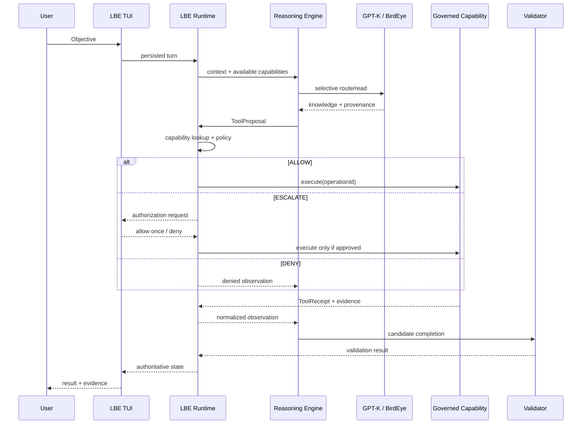

# GPT-Knowledge
The biggest mistake people make with ChatGPT is using vague, one-line prompts and expecting expert-level results.Here are the top 10 mistakes people make when using and prompting GPT models:Vague Prompts: Asking broad questions like "Write a marketing plan" gives the AI no direction, leading to generic and useless answers.Burying the Actual Ask: Tossing in your core question at the very end of a massive, unstructured wall of text confuses the model.Assuming It Remembers Everything: Believing the AI tracks your entire history or context from days prior without reminding it of your constraints or business details.Not Telling It What Good Looks Like: Failing to provide examples, style guidelines, tone, or formatting instructions upfront.Asking for Too Much in One Shot: Dumping a complex, multi-step project into a single prompt instead of breaking it down into smaller, manageable parts.Accepting the First Output: Treating the first response as final rather than treating it as a draft and pushing back or iterating.Ignoring Formatting Instructions: Leaving structural or length requirements (like word counts or bullet points) out until it is too late.Blindly Trusting the Facts: Believing everything the AI outputs without verifying calculations, code, or checking for hallucinations.Sharing Sensitive Information: Entering private data, passwords, or company secrets into public chat interfaces where privacy policies might expose them.Treating It Like a Search Engine: Using ultra-short, keyword-only queries instead of conversing with it like a knowledgeable assistant.
A versioned, reusable engineering knowledge base for research-backed design, development, debugging, validation, agent architecture, browser automation, local-model integration, Letterblack product design, and creative technology workflows.

## Load order
https://drive.google.com/drive/folders/1T8Hv-MUhdK34V9xM9gPRq9M1UvMF1HsI
loop test, > repo impliment > birdeye keep in watch, Gdrive memories and past, >dessision > looptooldo not drift toward single route or diffing into architecture. gpt-k has all the refrences no assumption allowed

Always begin with [`000_START_HERE.md`](000_START_HERE.md).001_MEMORY_DECISION_SUPPORT.md  When prior plans, decisions, rejected ideas, unfinished work, or historical contradictions may materially affect a decision, route through [`001_MEMORY_DECISION_SUPPORT.md`](001_MEMORY_DECISION_SUPPORT.md). Then use [`knowledge-index.json`](knowledge-index.json) for deterministic file/domain routing, [`knowledge-sections.json`](knowledge-sections.json) when a trigger maps to a stable section, or [`INDEX.md`](INDEX.md) as the human-readable companion.

Do not preload every domain. Knowledge guides decisions; it does not replace live workspace or runtime inspection.

## Letterblack MCP ecosystem entry point

Use [`project-engineering/letterblack-mcp-ecosystem-and-routing.md`](project-engineering/letterblack-mcp-ecosystem-and-routing.md) when a task needs to determine **which component should be used and which source owns the truth**.

Current validated client direction:
{
  "schema_version": 1,
  "purpose": "Curated machine-readable catalogue of real upstream agent repositories used as implementation references. Not project status, memory, or runtime authority.",
  "maintenance": {
    "human_index": "GPT_Ref/GPT_REF.md",
    "scope_contract": "GPT_Ref/README.md",
    "validator": "scripts/validate-gpt-ref-catalog.mjs"
  },
  "references": [
    {
      "id": "openai-codex",
      "name": "OpenAI Codex",
      "repository": "openai/codex",
      "url": "https://github.com/openai/codex",
      "default_branch": "main",
      "status": "active",
      "primary_uses": [
        "execution-runtime",
        "typed-events",
        "approvals",
        "sandbox",
        "tool-execution",
        "validation",
        "cancellation",
        "session-turn-item-lifecycle"
      ],
      "adopt": "Separation of model-authored messages from runtime/tool/approval/completion state.",
      "avoid": "Do not copy the complete runtime when only a lifecycle or execution-boundary pattern is needed.",
      "gptk_studies": [
        "ai-agents/studies/codex-execution-validation.md",
        "ai-agents/studies/exact-agent-feature-reference-chain-2026-09-20.md"
      ]
    },
    {
      "id": "cline",
      "name": "Cline",
      "repository": "cline/cline",
      "url": "https://github.com/cline/cline",
      "default_branch": "main",
      "status": "active",
      "primary_uses": [
        "provider-adapters",
        "model-turn-semantics",
        "tool-use-loop",
        "empty-response-handling",
        "model-capabilities",
        "agent-runtime",
        "team-sessions"
      ],
      "adopt": "Centralized provider/model result semantics, host-owned runtime construction, and explicit team/session lifecycle.",
      "avoid": "Do not create a second provider subsystem when the target already has one canonical owner.",
      "gptk_studies": [
        "ai-agents/cline-runtime-reuse-for-governed-agent-infrastructure.md",
        "ai-agents/studies/exact-agent-feature-reference-chain-2026-09-20.md"
      ]
    },
    {
      "id": "hermes-agent",
      "name": "Hermes Agent",
      "repository": "NousResearch/hermes-agent",
      "url": "https://github.com/NousResearch/hermes-agent",
      "default_branch": "main",
      "status": "active",
      "primary_uses": [
        "persistent-agent-loop",
        "messaging-gateways",
        "memory",
        "skills",
        "toolsets",
        "mcp",
        "channel-continuity",
        "tool-call-persistence"
      ],
      "adopt": "One agent core across channels, persistent turn orchestration, and progressive loading of memory, skills, and integrations.",
      "avoid": "Do not let gateway, memory, skills, or delegated work become a second untracked authority. Preserve working team/subagent features but keep parent/session ownership explicit.",
      "gptk_studies": [
        "ai-agents/studies/hermes-memory-skills-agent-loop.md",
        "ai-agents/studies/exact-agent-feature-reference-chain-2026-09-20.md"
      ]
    },
    {
      "id": "openhands",
      "name": "OpenHands Agent Canvas",
      "repository": "OpenHands/OpenHands",
      "url": "https://github.com/OpenHands/OpenHands",
      "default_branch": "main",
      "status": "active",
      "primary_uses": [
        "agent-canvas",
        "control-center",
        "backend-selection",
        "frontend-agent-client",
        "local-stack-orchestration"
      ],
      "adopt": "Use for the user-facing control-center boundary, backend selection, and client orchestration.",
      "avoid": "Do not treat OpenHands/OpenHands as the canonical agent/tool/conversation/workspace runtime owner; those implementations live in OpenHands/software-agent-sdk.",
      "gptk_studies": [
        "ai-agents/studies/openhands-autonomous-swe-runtime.md",
        "ai-agents/studies/exact-agent-feature-reference-chain-2026-09-20.md"
      ]
    },
    {
      "id": "openhands-software-agent-sdk",
      "name": "OpenHands software-agent-sdk",
      "repository": "OpenHands/software-agent-sdk",
      "url": "https://github.com/OpenHands/software-agent-sdk",
      "default_branch": "main",
      "status": "active",
      "primary_uses": [
        "autonomous-swe-runtime",
        "action-observation",
        "conversation-runtime",
        "workspace-abstraction",
        "lifecycle-state",
        "confirmation-policy",
        "agent-server"
      ],
      "adopt": "Use as the canonical OpenHands implementation reference for agents, tools, conversations, workspaces, events, security/confirmation, and the Agent Server API.",
      "avoid": "Do not confuse Agent Canvas frontend behavior with this runtime owner, and do not import the complete runtime when only a narrow action/observation or workspace contract is needed.",
      "gptk_studies": [
        "ai-agents/studies/openhands-autonomous-swe-runtime.md",
        "ai-agents/studies/exact-agent-feature-reference-chain-2026-09-20.md"
      ]
    },
    {
      "id": "aider",
      "name": "Aider",
      "repository": "Aider-AI/aider",
      "url": "https://github.com/Aider-AI/aider",
      "default_branch": "main",
      "status": "active",
      "primary_uses": [
        "repository-cognition",
        "repo-map",
        "git-aware-editing",
        "selective-context",
        "context-budgeting"
      ],
      "adopt": "Repository mapping and selective context expansion before edits.",
      "avoid": "Do not equate repository awareness with file authority or load the whole repository into context.",
      "gptk_studies": [
        "ai-agents/studies/aider-repository-cognition.md",
        "ai-agents/studies/exact-agent-feature-reference-chain-2026-09-20.md"
      ]
    },
    {
      "id": "lobehub",
      "name": "LobeHub",
      "repository": "lobehub/lobehub",
      "url": "https://github.com/lobehub/lobehub",
      "default_branch": "canary",
      "status": "active",
      "primary_uses": [
        "provider-registry",
        "model-registry",
        "configuration",
        "knowledge",
        "mcp",
        "integrations",
        "readiness"
      ],
      "adopt": "Separate provider/model metadata, configuration, capability, readiness, and integration lifecycle.",
      "avoid": "Do not treat configured state as runtime readiness.",
      "gptk_studies": [
        "ai-agents/studies/lobehub-provider-integration-architecture.md",
        "ai-agents/studies/lobehub-agent-skills-system.md",
        "ai-agents/studies/exact-agent-feature-reference-chain-2026-09-20.md"
      ]
    },
    {
      "id": "openclaw",
      "name": "OpenClaw",
      "repository": "openclaw/openclaw",
      "url": "https://github.com/openclaw/openclaw",
      "default_branch": "main",
      "status": "active",
      "primary_uses": [
        "gateway",
        "control-plane",
        "multi-surface-access",
        "session-continuity",
        "transport-boundaries",
        "run-ownership",
        "terminal-receipts"
      ],
      "adopt": "Keep session/agent identity independent from CLI, UI, browser, or messaging transports.",
      "avoid": "Do not let channel clients become separate reasoning authorities.",
      "gptk_studies": [
        "ai-agents/reference-derived-agent-architecture.md",
        "ai-agents/studies/agent-harness-reference-sources-2026-09-08.md",
        "ai-agents/studies/exact-agent-feature-reference-chain-2026-09-20.md"
      ]
    },
    {
      "id": "agent-zero",
      "name": "Agent Zero",
      "repository": "agent0ai/agent-zero",
      "url": "https://github.com/agent0ai/agent-zero",
      "default_branch": "main",
      "status": "active",
      "primary_uses": [
        "general-agent-runtime",
        "tools",
        "extensibility",
        "local-agent-experimentation"
      ],
      "adopt": "Use as a comparative implementation reference for extensibility and local-agent patterns.",
      "avoid": "Do not treat it as a default target architecture without checking ownership and lifecycle fit.",
      "gptk_studies": [
        "ai-agents/reference-derived-agent-architecture.md",
        "ai-agents/studies/exact-agent-feature-reference-chain-2026-09-20.md"
      ]
    },
    {
      "id": "gemini-cli",
      "name": "Gemini CLI",
      "repository": "google-gemini/gemini-cli",
      "url": "https://github.com/google-gemini/gemini-cli",
      "default_branch": "main",
      "status": "active",
      "primary_uses": [
        "browser-agent",
        "browser-session-lifecycle",
        "isolated-browser-tools",
        "tool-scheduler",
        "policy",
        "confirmation",
        "local-agent-executor",
        "gemini-native-cli"
      ],
      "adopt": "Use the browser-agent definition/factory/invocation/manager chain for browser-specialized agents, and the scheduler/policy/confirmation chain for tool execution.",
      "avoid": "Do not copy Gemini-specific model assumptions into provider-neutral layers; preserve the architectural seams rather than provider-specific defaults.",
      "gptk_studies": [
        "ai-agents/provider-neutral-agent-auth-and-model-routing.md",
        "ai-agents/studies/exact-agent-feature-reference-chain-2026-09-20.md"
      ]
    },
    {
      "id": "deepseek-harness",
      "name": "DeepSeek Harness",
      "repository": "deepseek-ai/deepseek-harness",
      "url": "https://github.com/deepseek-ai/deepseek-harness",
      "default_branch": "master",
      "status": "active",
      "primary_uses": [
        "agent-loop",
        "tool-scheduling",
        "browser-use-capability",
        "computer-use-capability",
        "subagent-lifecycle",
        "skills",
        "harness-seams"
      ],
      "adopt": "Use explicit package/service seams for the agent loop, ordered tool scheduling, browser/computer capability registration, subagent lifecycle, and skills.",
      "avoid": "Do not treat every plugin seam as a reason to fragment an existing target owner. Use the harness to make ownership explicit, not to create duplicate authority.",
      "gptk_studies": [
        "ai-agents/studies/agent-harness-reference-sources-2026-09-08.md",
        "ai-agents/studies/exact-agent-feature-reference-chain-2026-09-20.md"
      ]
    },
    {
      "id": "antigravity-cli",
      "name": "Google Antigravity CLI",
      "repository": "google-antigravity/antigravity-cli",
      "url": "https://github.com/google-antigravity/antigravity-cli",
      "default_branch": "main",
      "status": "active",
      "verified_revision": "7bb195acaec9e7788df5210d0dc3e15f3cefc6b3",
      "primary_uses": [
        "terminal-agent-ui",
        "persistent-history",
        "artifact-review",
        "permissions",
        "subagents",
        "background-tasks",
        "remote-control",
        "status-projection",
        "headless-mode",
        "mcp",
        "skills",
        "hooks",
        "plugins"
      ],
      "adopt": "Use its terminal projection, statusline/state projection, review/rewind, background-task, subagent, and permission interaction patterns while keeping target authority owners explicit.",
      "avoid": "The public repository does not contain the complete production core. Do not infer unavailable implementation internals from README/changelog examples; use official product docs for product behavior and the public repo only where source is actually present.",
      "gptk_studies": [
        "ai-agents/studies/exact-agent-feature-reference-chain-2026-09-20.md"
      ]
    },
    {
      "id": "claude-code",
      "name": "Claude Code",
      "repository": "anthropics/claude-code",
      "url": "https://github.com/anthropics/claude-code",
      "default_branch": "main",
      "status": "active",
      "verified_revision": "7974a70773fa229e4cc65aa1b356cc21f5c216c4",
      "primary_uses": [
        "cli",
        "interactive-agent-ui",
        "permissions",
        "hooks",
        "skills",
        "plugins",
        "mcp",
        "subagents",
        "agent-teams",
        "background-agents",
        "worktrees",
        "headless-json",
        "remote-control",
        "project-instructions"
      ],
      "adopt": "Use exact tool/permission names, project instruction scoping, hook lifecycle, subagent/team configuration, background-agent controls, and interactive CLI ergonomics where they fit the target owner.",
      "avoid": "The public repository is not a complete mirror of all production core internals. Product behavior should be anchored to official Claude Code docs and only source-backed extension/mod/plugin claims should be treated as repository implementation evidence.",
      "gptk_studies": [
        "ai-agents/studies/exact-agent-feature-reference-chain-2026-09-20.md"
      ]
    },
    {
      "id": "opencode",
      "name": "OpenCode",
      "repository": "anomalyco/opencode",
      "url": "https://github.com/anomalyco/opencode",
      "default_branch": "dev",
      "status": "active",
      "verified_revision": "ebb7b76eca82342642c78645109e865614533827",
      "primary_uses": [
        "cli",
        "tui",
        "desktop",
        "provider-registry",
        "model-registry",
        "tool-registry",
        "permissions",
        "agents",
        "subagents",
        "sessions",
        "mcp",
        "plugins",
        "skills",
        "lsp",
        "remote-attach",
        "web-server",
        "workspace-ui",
        "diff-ui"
      ],
      "adopt": "Use its explicit CLI/TUI/runtime separation, provider/model routing, permission-gated tool registry, session/child-session projection, remote attach/server surfaces, and runtime-vs-TUI configuration split.",
      "avoid": "Do not transplant OpenCode's runtime authority wholesale into a target that already owns authorization, execution, receipts, persistence, validation, or completion. Reuse presentation and registry seams without duplicating target authority.",
      "gptk_studies": [
        "ai-agents/studies/exact-agent-feature-reference-chain-2026-09-20.md"
      ]
    }
  ]
}
```text
Codex / Cline / OpenCode / Gemini / Antigravity / Claude
                            │
                            └──> BirdEye MCP
                                  ├── workspace query
                                  ├── memory query
                                  └── skills query

Skills
  -> canonical curated reasoning/workflow corpus
  -> skill-gallery-router may guide where to look
  -> actual curated retrieval uses BirdEye MCP skills(query/fetch/status)

GPT-Knowledge
  -> durable project/method/status/reference projection and routing

BirdEye MCP
  -> consolidated client-facing Letterblack MCP route
  -> current local evidence/index
  -> GPT-Knowledge route/read access
  -> Memory query/read access
  -> consolidated Skills retrieval
  -> workspace/revision identity
  -> governed local execution
  -> EYES/derived query health where active

Memory
  -> canonical historical conversations/messages/provenance
  -> accessed through BirdEye in the validated client topology

GitHub
  -> canonical remote repository/branch/commit/PR/check truth

Runtime / Browser / Provider
  -> live behavior proof
```

The validated MCP Local architecture reports **53 required PASS / 0 FAIL** and keeps BirdEye as the consolidated enabled Letterblack MCP route for the checked clients. Duplicate direct Memory routes, separate Skills routes, broad filesystem bypasses, and legacy competing MCP routes are absent or disabled.

BirdEye may expose a capability without becoming the canonical owner of the underlying source. Memory remains the historical owner, Skills remain the curated methodology/content owner, GPT-Knowledge remains the durable project/method projection owner, and GitHub remains remote repository truth.

## Purpose

This repository stores reusable knowledge rather than project-specific implementation details.

```text
Research
→ extract universal principles
→ consolidate overlapping methods
→ document evidence and applicability
→ apply to a project
→ validate in runtime
→ promote reusable lessons back here
```

## Agent engineering entry point

Use [`ai-agents/unified-agent-engineering-methods.md`](ai-agents/unified-agent-engineering-methods.md) as the **single canonical agent-engineering guide**.

It consolidates techniques learned from Aider, Claude Code, Codex, Hermes, LobeHub, OpenHands, and the existing cross-project studies into problem-driven methods for:

- repository cognition and structural discovery;
- hypothesis-driven debugging;
- controlled execution and approvals;
- runtime/user-visible validation;
- duplicate-authority and regression scanning;
- state, memory, skills, and checkpoints;
- providers, models, tools, MCP, and integrations;
- autonomous action/observation loops;
- recovery, retry, and completion evidence.

The canonical rule is **method first, source second**. Diagnose the actual failure or requirement, choose the appropriate method from the unified guide, then consult a source-specific study only when concrete implementation detail is useful.

Documents under `ai-agents/studies/`, `ai-agents/cli-agent-reference-study-map.md`, and `ai-agents/reference-derived-agent-architecture.md` remain research provenance and implementation references. They are not competing operating modes.

### Curated upstream agent references

Use [`GPT_Ref/GPT_REF.md`](GPT_Ref/GPT_REF.md) when the task needs a **real upstream agent repository** to compare against before implementing or redesigning a subsystem. `GPT_Ref` is deliberately narrow: it contains the human catalogue, the machine-readable [`agent-references.json`](GPT_Ref/agent-references.json), and its maintenance contract only.

Do not place project status, Brew reports, memory, copied source, research transcripts, or arbitrary documents in `GPT_Ref/`. Long-form comparative research belongs under `ai-agents/studies/`; project-specific truth belongs under the relevant project namespace; live truth belongs in the current workspace/runtime.

For Letterblack debugging involving authority, guards, policy, proof, blocked actions, or completion boundaries, selectively load [`ai-agents/letterblack-governance-debugging-references.md`](ai-agents/letterblack-governance-debugging-references.md). It routes to [LBE Core](https://github.com/Letterblack0306/LetterBlack-LBE-Core) for governed execution boundaries and [LB Guards & Rules](https://github.com/Letterblack0306/LB_Guards_Rules) for workspace trust, guard contracts, and current-HEAD proof. It is optional and must not be preloaded for unrelated debugging.

## Letterblack branding entry point

Use [`letterblack-branding/industrial-dark-ui-system.md`](letterblack-branding/industrial-dark-ui-system.md) as the canonical Letterblack product UI/branding guide. It defines the Industrial Dark palette, typography, density, cockpit layout, state semantics, interaction behavior, component language, icon rules, and evidence-aware UI principles.

Use [`letterblack-branding/ui-screen-system.md`](letterblack-branding/ui-screen-system.md) when screen families or the operational component vocabulary are needed. Use [`letterblack-branding/adobe-ai-generations-ui-reference.md`](letterblack-branding/adobe-ai-generations-ui-reference.md) only when inspecting reusable UI/token/icon patterns from `Adobe_AI_Generations-04`; that repository is a reference implementation, not canonical brand truth.

## Browser knowledge entry point

Use [`browser-agents/browser-access-tooling-and-evidence.md`](browser-agents/browser-access-tooling-and-evidence.md) for browser transports, target identity, inspect/action/capture tools, DOM annotation, host-browser trust bridges, screenshots, evidence, lifecycle, permissions, and validation.

## Local-model knowledge entry point

Use [`local-models/lm-studio-runtime-and-agent-integration.md`](local-models/lm-studio-runtime-and-agent-integration.md) for LM Studio server configuration, authentication, model discovery and lifecycle, stateful chats, tool calling, structured output, MCP controls, multi-machine proxy routing, performance tuning, and provider health evidence.

When agent-side provider routing, health, permissions, recovery, or validation is involved, pair it with the unified agent-engineering guide rather than loading a provider-project study directly.

## Motion-design entry point

Use [`motion-design/house-style.md`](motion-design/house-style.md) as the default starting point for motion-design and video-composition work when project-specific direction is not available. Project-specific brand direction takes precedence.

## Current knowledge domains

- `GPT_Ref/` — curated external agent-repository catalogue only; validated against a machine-readable manifest and strict folder scope.
- `ai-agents/` — unified agent engineering methods plus source-specific research provenance and selective Letterblack governance/debugging references.
- `letterblack-branding/` — canonical Industrial Dark Letterblack UI branding, operational screen system, UI/icon reference catalogue.
- `browser-agents/` — browser access models, CDP and connector patterns, target management, browser tools, security, screenshots, and verification.
- `local-models/` — local-provider runtimes, model lifecycle, inference configuration, health checks, tool calling, structured output, and multi-machine routing.
- `ui-engineering/` — validated runtime UI integration and shell behavior.
- `motion-design/` — canonical creative direction, palettes, composition patterns, motion systems, captions, and visual styles.

# LBE UI Agents Research Update: GPT-K Knowledge Plane, Governed Agent Runtime, and Terminal-First Interface

## Executive summary

The existing UI-agents research should be re-centered around a different question. Instead of asking **“what do the best coding-agent interfaces look like?”**, the document should ask:

> **How should the LBE product expose a reasoning agent that is grounded by GPT-Knowledge, constrained by LBE authority, connected to the Letterblack tool ecosystem, and understandable through a terminal-first operational interface?**

That shift matters because the current Letterblack architecture is materially more specific than a generic agent IDE. GPT-Knowledge defines itself as a **versioned engineering knowledge base and deterministic routing layer**, not as a model or execution runtime. Its own operating contract says it must not replace current repository, workspace, or live runtime evidence. fileciteturn4file0L2-L2 fileciteturn5file0L2-L2 Therefore, the phrase **“GPT-K as the primary knowledge/agent model” should be corrected architecturally**:

**GPT-K should be the primary knowledge plane and reasoning-context router. It should not become the reasoning model, tool executor, or runtime authority.**

The current architecture instead points to this separation:

```text
GPT-K            = knowledge, methods, routing, durable project projection
Reasoning engine = adaptive interpretation, planning and tool selection
LBE              = session + policy + authorization + execution + evidence + completion authority
BirdEye          = consolidated local knowledge/evidence/capability access surface
Memory           = historical conversation/session provenance
Skills           = curated procedural/reasoning corpus
GitHub           = canonical remote repository truth
Runtime          = current behavior truth
TUI              = truthful projection and operator-control surface
```

GPT-K explicitly describes BirdEye as the consolidated route through which agents can access workspace evidence, Memory, Skills, and GPT-K route/read capabilities, while preserving separate canonical ownership of those sources. fileciteturn4file0L2-L2 The dedicated ecosystem document repeats the same distinction and warns that configuration validity is not the same thing as live-runtime validity. fileciteturn6file0L2-L2

LBE is correspondingly converging on a **reasoning-engine-independent authority core**. The September 20 architecture plan states that Cline should remain a supported adapter, native LBE or other reasoning engines should be possible, providers should be independently replaceable, and no reasoning engine or provider should acquire LBE authority. fileciteturn18file0L2-L2 The most useful product sentence in the current project material is therefore:

> **Agent/provider reasons. LBE governs. Registered capabilities execute. Evidence and ToolReceipts persist. Validation decides completion. The interface projects the result.** fileciteturn7file0L2-L2

The present TUI is already significantly closer to this goal than a competitor-only research document would imply. Current source implements Ratatui-based terminal rendering, compact and wide layouts, `LIVE` versus `PREVIEW` runtime distinction, workspace/session context, command palette, provider/model selectors, session history, delegated agents, extension registry, tools, processes, activity, evidence, receipts, changes, checkpoints, Memory, workspace tree/search, diagnostics, and keyboard-driven control. fileciteturn20file0L2-L2 fileciteturn22file0L2-L2 Current source also has an explicit authorization surface showing capability, tool, input, risk, operation ID, approval ID, and rationale, with `Enter` granting the specific operation once and `Esc` denying it; the screen explicitly states that LBE remains the authority owner. fileciteturn11file0L2-L2

The updated research document should consequently be **a product architecture and interaction specification, not a mood board**.

The recommended positioning is:

**LBE is an evidence-native terminal IDE for governed agents. GPT-K gives the agent institutional knowledge; the selected reasoning engine supplies intelligence; LBE decides what may actually happen; ToolReceipts and evidence show what did happen; the TUI makes that entire boundary legible without turning the screen into a log dump.**

The strongest competitive lessons are also converging around this problem. Cursor distinguishes read-only and autonomous modes and makes background-agent state visible. citeturn6search0turn6search2 Codex has moved toward a multi-agent command-center model with isolated worktrees and reviewable diffs. citeturn6search1turn6search14 Claude Code explicitly separates permission modes and has experimented with reducing approval fatigue. citeturn3search4turn3search7 Cline persists complete task sessions and exposes tool-approval callbacks. citeturn4search0turn4search1 Windsurf exposes pre/post governance hooks and parallel isolated worktrees. citeturn5search1turn5search2 Warp is pushing terminal, agent, plan, search and IDE-like interaction into one environment. citeturn7search2turn8search0 Aider demonstrates how far a comparatively austere terminal interface can go with explicit modes, repository context, diffs and reversible Git operations. citeturn7search0turn7search1turn7search14

The resulting LBE design should **borrow interaction clarity rather than imitate product chrome**.

A final evidence caveat is important. I could not locate an accessible Google Drive file clearly titled “UI Agents” through searches for both `UI Agents` and `agent ui`. The connected GitHub repositories contain substantial LBE UI, architecture, research and branding material, but no uniquely identifiable document bearing that exact title surfaced. Accordingly, this report defines the **replacement thesis and update content** rather than claiming to have modified a specific existing Drive document. Likewise, `OTP` did not resolve to an authoritative Letterblack acronym in the connected repositories; the TUI recommendations below are therefore concrete, while **OTP-specific semantics remain UNKNOWN rather than being invented**.

## GPT-K and LBE architectural center

### GPT-K should be the knowledge plane, not a new agent runtime

GPT-Knowledge describes itself as a reusable, versioned engineering knowledge repository spanning design, development, debugging, validation, agent architecture, browser automation, local-model integration and Letterblack product design. Its mandatory load sequence begins with `000_START_HERE.md`, conditionally routes through memory-decision support, then uses `knowledge-index.json` for deterministic domain routing and `knowledge-sections.json` for stable trigger-to-section routes. It explicitly says not to preload every domain. fileciteturn4file0L2-L2

`knowledge-sections.json` confirms that this routing is machine-oriented: triggers such as “which source owns truth,” “memory vs GitHub,” and “old plan contradicts current implementation” resolve to bounded files/anchors rather than an instruction to inject the entire repository into context. fileciteturn17file0L2-L10

That yields a useful GPT-K invocation pattern:



The crucial rule is that **GPT-K supplies prior knowledge, not current truth by default**. `000_START_HERE.md` requires real shipping/source/runtime evidence before architectural recommendations and establishes an explicit evidence hierarchy in which live runtime and active source outrank durable knowledge. It also defines `PROVEN`, `SUPPORTED`, `HYPOTHESIS`, `UNKNOWN` and `BLOCKED` as distinct evidence classes. fileciteturn5file0L2-L2

For the UI this creates an unusually valuable opportunity: **knowledge provenance can become visible product behavior**. The user should be able to tell whether an agent statement came from GPT-K guidance, current source, historical Memory, GitHub, or a runtime receipt without having five separate chat windows.

### GPT-K data and access model

The best-supported source map is:

| Source | Canonical role | Agent access | What the UI should show |
|---|---|---|---|
| GPT-K | Durable methods, project/status projection, architecture and reference routing | Prefer BirdEye `knowledge_route` / `knowledge_read`; deterministic manifest routing | `KNOWLEDGE · GPT-K`, document/revision/verification state |
| BirdEye | Local workspace/index evidence plus consolidated capability access | MCP/local capability surface | workspace identity, SHA/freshness, health |
| Memory | Historical conversations, agent sessions and provenance | BirdEye Memory query/read | `HISTORY`, timestamp/session/source, stale/superseded status |
| Skills | Curated workflows and procedural guidance | BirdEye `skills(query/fetch/status)` | selected skill and why it was invoked |
| GitHub | Remote branches, commits, PRs and checks | GitHub integration | repo/ref/commit/check state |
| Runtime/browser/provider | Current execution behavior | Runtime-specific capability | `LIVE`, event/operation/receipt correlation |

This ownership model is directly described by GPT-K and the Letterblack MCP routing document. fileciteturn4file0L2-L2 fileciteturn6file0L2-L2

The practical limitation is deliberate: GPT-K can tell an agent **where to look and what methods have been established**, but it cannot by itself prove that the installed program, branch, process, provider or UI currently behaves that way. fileciteturn5file0L2-L2 That should remain visible in the interface through freshness, revision and evidence classifications rather than hidden behind a generic “AI knows this” presentation.

### LBE is the non-transferable authority core

The newest internal architecture direction makes LBE independent of any one reasoning engine:

```text
LBE Core
 ├─ Reasoning Engine Registry
 │   ├─ Cline adapter
 │   ├─ Native LBE reasoning
 │   └─ future engines
 │
 └─ Provider / Model Registry
     ├─ OpenAI
     ├─ Anthropic
     ├─ Gemini
     ├─ OpenRouter
     ├─ LM Studio / OpenAI-compatible
     ├─ Ollama / local
     └─ future providers
```

The design document says LBE retains workspace/project identity, session/turn/task/operation identity, mode/policy truth, deterministic authorization, capability registration, governed tool execution, idempotency, ToolReceipts, evidence provenance, persistence/recovery, cancellation terminality, validation and completion truth. A reasoning engine may reason, plan and propose tools but may not acquire direct filesystem/process/Git/MCP/browser or completion authority. fileciteturn18file0L2-L2

That separation should be the conceptual centerpiece of the revised UI research.

| Layer | May reason? | May choose a tool? | May authorize? | May execute directly? | Owns completion? |
|---|---:|---:|---:|---:|---:|
| GPT-K | No runtime reasoning role | No | No | No | No |
| Reasoning engine | Yes | Yes, by proposal | No | No | No |
| Provider/model | Generates model output | Indirectly through engine | No | No | No |
| LBE | Governs lifecycle | Resolves exposed capabilities | **Yes** | Through governed executor | **Yes** |
| Registered capability | No | No | No | **Only after LBE authorization** | No |
| TUI | No | User can request/select | User supplies approval where required | No | Projects LBE result |

This distinction is also consistent with earlier historical LBE research in the uploaded project material, which framed the flow around agent proposal, LBE validation/control, governed adapter execution and audit/completion evidence; that material should be treated as historical support, not as a substitute for current source. fileciteturn0file0

### Known LBE tool and API surface

The current source gives us more than an “unspecified tool list,” but the list should be labeled **observed, not exhaustive**. Current code exposes or references these governed identifiers:

| Source-observed capability | Class | Mutation potential | UI representation |
|---|---|---:|---|
| `workspace.read` | workspace | No | inline read/evidence card |
| `workspace.list` | workspace | No | tree/list |
| `workspace.glob` | workspace | No | search result |
| `workspace.search` | workspace | No | search stream |
| `workspace.patch` | workspace | **Yes** | diff + authorization gate |
| `process.run_registered` | process | Potentially | command card + stdout/stderr + receipt |
| `mcp.birdeye.<read-tool>` | external/BirdEye | Observed as read-path family | knowledge/evidence result |
| Other installed capabilities | Unknown until registered | Unknown | never infer permissions from name |

The tool identifiers are visible in current LBE source and the Cline-governed bridge. fileciteturn12file0L15-L18 fileciteturn12file1L20-L39 Current `product_entry.py` imports `ToolRegistry`, `ToolRequest`, `ToolReceipt`, workspace handlers and governed coding handlers; it also exposes product-level surfaces for `start`, `turn`, `control`, capability management, exports, governed tool invocation and authorization evaluation/resolution. fileciteturn13file0L2-L2

The newer architecture plan separately reports generic installed extension kinds for `mcp`, `skill`, `plugin`, `hook`, `connector`, `subagent`, `network`, and `hosted_service`, but correctly stops short of claiming that every installed extension has passed live end-to-end acceptance. fileciteturn18file0L2-L2

This distinction should survive into the UI:

```text
INSTALLED  ≠  ENABLED
ENABLED    ≠  REACHABLE
REACHABLE  ≠  AUTHORIZED
AUTHORIZED ≠  EXECUTED
EXECUTED   ≠  VALIDATED
VALIDATED  ≠  COMPLETE
```

That is a much stronger product story than a conventional “Tools: 12 connected” badge.

## Agent behavior and governed execution

The revised document should define agent behavior from **observable state transitions**, while avoiding the opposite mistake of turning lifecycle labels into a rigid second planner. GPT-K's unified agent methodology explicitly says that the reasoning model should remain adaptive: it researches, chooses a capability, observes the real result, revises its understanding and validates consequential outcomes. Lifecycle states exist for persistence, observability, cancellation and UI truth; they are not supposed to replace model reasoning. fileciteturn9file0L2-L2

### Recommended interaction loop



The critical UI rule is that these are **different things**:

```text
model intent
≠ tool proposal
≠ authorization request
≠ user decision
≠ execution
≠ tool result
≠ validation
≠ completion
```

That distinction comes directly from GPT-K's canonical agent-engineering methods. fileciteturn9file0L2-L2

### Planning should be visible, but not expose private chain-of-thought

LBE does not need to display unrestricted model reasoning to achieve transparency. It should expose an **operational plan** consisting of user-relevant objectives, current step, evidence sought, capability chosen, decision boundary and resulting observation.

A good streamed trace is:

```text
PLAN       Inspect current auth owner
KNOWLEDGE  GPT-K → governance/debugging route
SEARCH     workspace.search("resolve_authorization")
FOUND      3 active candidates
INSPECT    runtime/authorization_resolver.py
CONCLUDE   owner established [SOURCE]
PROPOSE    workspace.patch · risk: WRITE
WAIT       authorization required
```

Not:

```text
THOUGHT 1...
THOUGHT 2...
THOUGHT 3...
```

The former is verifiable operational telemetry; the latter adds cognitive noise and creates an unnecessary dependency on internal model reasoning.

### Tool selection and handoffs

The reasoning engine should receive a capability projection from LBE and select among what is genuinely available. The planned engine-neutral contract normalizes engine output into concepts such as `ToolProposal`, `ContinuationRequest`, `ReasoningResponse` and `ReasoningFailure`; all tool proposals then converge on the same LBE authorization/execution path. fileciteturn18file0L2-L2

The canonical handoff should therefore look like:



This also gives subagents a clean place in the architecture. A child agent may reason independently, but it should not become a second LBE. The engine-independence plan explicitly permits multiple reasoning workers while maintaining one authorization, execution, receipt and completion boundary. fileciteturn18file0L2-L2

### Error recovery

Recovery should be presented as **observation-driven replanning**, not as an invisible retry spinner.

GPT-K says retries should preserve operation identity and occur only when the failure is retryable, target identity remains valid, previous success has not occurred invisibly, duplicate execution is prevented and retry budget remains. fileciteturn9file0L2-L2

That suggests five useful UI states:

| Failure state | What the agent may do | What user sees |
|---|---|---|
| Tool unavailable | choose another evidence path | `DEGRADED · alternative route selected` |
| Tool execution failed | inspect real failure and adapt | stderr + operation ID + next step |
| Authorization denied | find non-mutating route or block | denial remains visible |
| Validation failed | revise work, do not claim done | `VALIDATION FAILED` |
| Evidence unavailable | stop conclusion at boundary | `BLOCKED / UNKNOWN`, never synthetic success |

Current LBE code already provides persistent cancellation/interruption operations and operational events containing session, turn, provider request, tool call, runtime operation and ToolReceipt identifiers, giving the interface a concrete correlation model rather than requiring heuristic log parsing. fileciteturn13file0L2-L2

## Terminal interface and visual language

`OTP` has no authoritative definition in the connected LBE/GPT-K sources I inspected, so it should be marked **UNKNOWN** in the research document until its internal meaning is supplied. No architecture should be invented around that acronym. The TUI, by contrast, has substantial current implementation evidence.

### The current TUI is already an operational cockpit

At current source, the LBE terminal app uses Ratatui/Termina and contains explicit accessibility/environment behavior for `NO_COLOR`, ASCII mode and no-animation mode. It shifts to a compact single-pane arrangement below its wider breakpoint and adds a navigation sidebar when sufficient terminal width is available. The header distinguishes `LIVE` from `PREVIEW`, displays mode and runtime connection state, and the workspace sidebar surfaces current session and workspace identity. fileciteturn20file0L2-L2

The application state includes transcript, activity log, current phase, mode, command palette, provider/model/session pickers, execution IDs, ToolReceipt/evidence references, process activity, tool/risk state, authorization IDs/verdict/rationale, audit findings, workspace file/list/patch state and checkpoint state. fileciteturn22file0L2-L2

Its current command palette already exposes a strong operational vocabulary:

```text
/status       runtime/session/provider/engine/context
/provider     provider inspection
/models       model selection
/sessions     persisted sessions
/history      session history
/agents       delegated child runs
/extensions   MCP + skills + plugins + hooks + connectors
/tools        governed tool projection
/processes    process activity
/activity     runtime events
/evidence     evidence references
/receipts     ToolReceipts
/changes      diff/change state
/undo         checkpoint comparison/restoration
/compact      context compaction
/memory       recent session memory
/browser      browser-agent connection
/tree         workspace browser
/find         workspace search
/doctor       diagnostics
/new          persisted session
/help         keyboard/command help
```

These commands are present in current `app.rs`. fileciteturn22file0L2-L2

Current keyboard interaction includes `Ctrl-P` for the command palette, `?` for shortcuts, `Tab` for mode cycling, `F2` for provider, `F3` for model, `@` for the authoritative workspace browser, `Ctrl-C` to abort an active task and ordinary navigation/scroll controls for files and panels. fileciteturn22file0L2-L2

That means the research document should no longer describe command palettes, diff review, approvals or runtime state as speculative inspiration. Several are **existing LBE behavior**.

### Recommended primary layout

The best next evolution is not a denser dashboard; it is a stronger hierarchy around the current source:

```text
┌ LBE ─ workspace/repo ─ mode ─ engine:model ─ LIVE ────────────────┐
│                                                                  │
│  TASK / SESSION                  PRIMARY TRANSCRIPT               │
│  ─────────────                  ───────────────────────────────   │
│  ▾ Objective                    USER                              │
│    ● research                   > Fix the authentication race     │
│    ● inspect                                                      │
│    ◐ patch                      AGENT                             │
│    ○ validate                   I found two competing owners...   │
│                                  ▾ PLAN 3/5                       │
│  CHILD RUNS                       ▾ GPT-K · 2 sources             │
│  └ worker: tests                  ▾ TOOL · workspace.search       │
│                                  ▾ RESULT · 3 matches             │
│                                  ▾ PATCH · 2 files                │
│                                                                  │
├──────────────────────────────────────────────────────────────────┤
│ ACTIVITY     RECEIPTS     DIFF     TERMINAL     EVIDENCE          │
│ 14:21:08  ALLOW workspace.read  op_42  receipt_88 ✓              │
│ 14:21:09  GPT-K route: governance/debugging                      │
│ 14:21:11  ESCALATE workspace.patch                               │
├──────────────────────────────────────────────────────────────────┤
│ > _                                               Ctrl-P COMMANDS │
└ PLAN ─ OPENAI:gpt-x ─ 68% ctx ─ 1 pending approval ─ LIVE ──────┘
```

The center stays conversational; the left side answers **“what is the agent doing?”**; the bottom answers **“what actually happened?”** This is preferable to putting a generic file explorer permanently beside chat because the LBE differentiator is not file browsing—it is governed execution.

### Approval flow should become a signature interaction

Current LBE already renders:

```text
ACTION GATE // AUTHORIZATION REQUIRED

Capability  ...
Tool        ...
Input       ...
Risk        ...
Operation   ...
Approval    ...

[rationale]

[Enter] allow once    [Esc] deny    [?] shortcuts
```

and explicitly states that approval does not become session-wide permission. fileciteturn11file0L2-L2

That is one of the strongest showcaseable behaviors in the product and should be made visually unmistakable.

Recommended behavior:

```text
normal transcript
     ↓
agent proposes mutation
     ↓
whole center pane compresses by ~10–15%
     ↓
amber ACTION GATE enters
     ↓
diff + exact capability + target + risk + operation
     ↓
[Enter] ALLOW ONCE     [Esc] DENY     [D] VIEW DIFF
     ↓
gate resolves into immutable receipt row
```

Do **not** show a modal saying only “Agent wants to edit files — Allow?” The LBE product value lies precisely in being able to name the operation and evidence behind it.

### Minimal sci-fi should mean instrumentation, not decoration

The canonical Letterblack visual guide calls for an **Industrial Dark** system combining high-end IDE and mission-control instrumentation. Its established tokens include `#0b0b0c` base, `#141416`/`#1c1c1f` surfaces, `#2a2a2d` borders, `#e1e1e6` main text, muted gray metadata and `#ff3b3b` as the Letterblack red signal. Green is reserved for verified health/live state and amber for waiting/warnings. fileciteturn8file0L2-L10

The guide also calls for compact 9–12 px-equivalent labeling, restrained 1 px boundaries, minimal radii, thin progress and a cockpit spatial hierarchy, while explicitly prohibiting UI animation that falsely implies work is happening. fileciteturn8file0L2-L10

For a terminal, translate that into:

| Design dimension | LBE recommendation |
|---|---|
| Typography | One legible mono family in the terminal; use weight/case rather than multiple fonts |
| Density | Dense enough to retain transcript + state + evidence; avoid card-per-event |
| Borders | Single-line structural separators; avoid boxes around every item |
| Red | brand identity, critical action/failure, not general decoration |
| Green | only verified live/healthy/success |
| Amber | waiting, approval, uncertain/risk state |
| Gray | inactive, metadata, historical |
| Motion | cursor/progress pulse only while backed by a live runtime event |
| Glow | effectively none in TUI; one restrained live indicator is enough |
| Spatial hierarchy | conversation center; task context left when space permits; operational receipts below |
| Accessibility | retain `NO_COLOR`, ASCII and no-animation variants already present in source |

The desired feeling is closer to **flight instrumentation** than cyberpunk: lots of state, very little spectacle.

## Competitive reference set

The most useful references are not necessarily the products whose aesthetics should be copied. They are products that have solved one part of LBE's interaction problem particularly well.

| Reference | Useful pattern | Main strength | Tradeoff / what not to copy | Relevance to LBE |
|---|---|---|---|---|
| **Cursor Agent / Background Agents** | Explicit Ask/Agent/Custom modes; background-agent list, status, follow-up and takeover | Clear distinction between read-only exploration and autonomous work; remote agents remain inspectable | Cursor's background agents can auto-run terminal commands with network access, which its own docs flag as increasing exfiltration risk; LBE should not equate background autonomy with bypassing its authority layer. citeturn6search0turn6search2 | **Very high** for mode/status UX |
| **OpenAI Codex** | Multi-agent command center, parallel threads, isolated work, reviewable diffs | Strong answer to supervising multiple long-running agents; system-level sandbox and permission boundaries | Desktop command-center metaphor is broader and more graphical than the desired LBE terminal surface; use orchestration concepts rather than copying layout. citeturn6search1turn6search14 | **Very high** for task/agent hierarchy |
| **Claude Code** | Permission modes, Plan/manual/auto distinctions, terminal-native operation | Mature terminal interaction and explicit authority choices; auto mode directly addresses approval fatigue | Automated approval classifiers introduce a different trust model; LBE's deterministic governance should remain its own authority rather than outsourcing permission semantics to the reasoner. citeturn3search4turn3search5turn3search7 | **Very high** for terminal approvals |
| **GitHub Copilot coding agents** | Issue/task delegation → background work → draft PR → human review | Excellent asynchronous handoff and review boundary; session logs and GitHub control plane create clear accountability | Primarily repository/PR-centric rather than immediate interactive terminal control, so it is a stronger reference for background jobs than LBE's primary conversational loop. citeturn3search0turn3search1turn3search10 | **High** for remote/handoff flows |
| **Cline** | Persistent tasks, checkpoints, conversation/tool/decision history, event subscriptions and approval callbacks | Very strong persisted-session mechanics and tool-event surface | Cline's own harness can own persistence/tools/approvals; embedding that authority directly would conflict with LBE's architecture. LBE's plan explicitly keeps Cline behind an adapter instead. citeturn4search0turn4search1 fileciteturn18file0L2-L2 | **Critical** because it is an existing LBE integration |
| **Windsurf Cascade** | Hooks around agent actions; isolated parallel worktrees/Arena | Pre/post action hooks provide a strong governance/telemetry reference; parallel model comparison is cleanly isolated | Hooks are shell programs running with user-account permissions, and Windsurf warns that poorly designed hooks can modify/delete/expose data; LBE should expose governed extensions without making raw hooks the authority layer. citeturn5search1turn5search2 | **High** for extensibility and parallel runs |
| **Warp** | Unified terminal/agent input, command search, agent history, plans, task lists, permission controls | Probably the closest contemporary reference for making terminal + agent + editor concepts feel like one product; `Ctrl-R` search unifies commands and agent history. citeturn7search2turn8search0turn8search2 | Warp intentionally grows toward a full agentic development environment; LBE should resist surface-area creep and make governance/evidence its distinctive layer | **Very high** for TUI interaction language |
| **Aider** | `/ask`, `/code`, `/architect`; repo map; explicit diff/Git workflow; reversible changes | Demonstrates that a terminal UX can remain extremely compact while supporting modes, codebase cognition, diffs and undo | Architect mode deliberately uses extra model stages, and Aider is fundamentally pair-programming oriented rather than an authority/evidence runtime. citeturn7search0turn7search1turn7search14 | **High** for minimal terminal discipline |

Three broad trends emerge from these primary sources.

First, **mode is becoming an explicit UX primitive**. Cursor separates Ask from Agent; Claude Code exposes Plan and permission modes; Aider separates ask/code/architect; LBE already cycles Plan/Build/Audit. citeturn6search2turn3search5turn7search1 The LBE improvement is to connect the mode indicator to actual authority, not merely prompt behavior.

Second, **background work requires stronger supervision surfaces rather than less UI**. Cursor exposes background-agent status/takeover, Codex is explicitly a command center for parallel agents, and GitHub makes asynchronous agents visible through issues, PRs and session logs. citeturn6search0turn6search1turn3search1 LBE's task tree therefore deserves first-class space.

Third, **approval fatigue is now a product-design problem**. Anthropic explicitly identifies frequent approvals as a motivation for Auto Mode, while Warp exposes fine-grained autonomy controls. citeturn3search4turn3search7turn8search2 LBE's solution should not be “ask less often” in the abstract; it should be **classify capabilities rigorously, auto-allow genuinely safe/read-only classes, and make the remaining high-value approval requests unusually informative**.

## Showcase concepts and interaction scenarios

The showcase should prove system behavior, not merely show a polished idle screen. Five scenarios together would communicate nearly the entire LBE/GPT-K proposition.

### Core screen families

A compact set of four screen compositions is sufficient:

| Screen | Purpose | Dominant element |
|---|---|---|
| **Agent Cockpit** | Normal conversation + task execution | transcript + plan/task tree |
| **Action Gate** | Human-in-the-loop authorization | risk + exact operation + diff |
| **Evidence / Receipt Inspector** | Explain what actually happened | correlated event/receipt/evidence chain |
| **Agent Wall** | Parallel parent/child/background work | task tree + run health + handoffs |

Everything else—Memory, GPT-K, tools, providers, sessions, extensions—can be panels or command-palette destinations rather than new top-level products.

### Scenario: evidence-grounded investigation

The user types:

```text
> Find why provider selection is falling back incorrectly. Do not modify anything.
```

The ideal visible sequence is:

```text
PLAN     audit / read-only
GPT-K    route → agent engineering / provider routing
SOURCE   inspect current workspace/revision
SEARCH   provider binding / fallback
READ     4 files
COMPARE  GPT-K architecture vs current implementation
FINDING  silent fallback path located
EVIDENCE source: 2   runtime: 0
VERDICT  SUPPORTED, runtime proof not yet collected
```

There is no approval dialog because the actions are read-only. The interesting showcase point is that the UI distinguishes **GPT-K guidance** from **current source evidence** and refuses to promote static analysis to live runtime proof. That behavior follows GPT-K's evidence gate. fileciteturn5file0L2-L2

### Scenario: governed patch with approval

The user continues:

```text
> Fix it and run the focused tests.
```

The agent proposes the patch but cannot mutate merely because the reasoning engine wants to.

```text
TOOL PROPOSAL
workspace.patch
target: provider_registry.py
risk: WRITE
expected_sha256: …
operation: op_7f21
```

The TUI changes to the source-backed authorization gate:

```text
ACTION GATE // AUTHORIZATION REQUIRED

Capability  workspace.patch
Tool        workspace.patch
Target      provider_registry.py
Risk        WRITE
Operation   op_7f21
Approval    apr_1c44

Reason:
Remove unconfigured silent fallback and preserve explicit provider failure.

[Enter] ALLOW ONCE   [Esc] DENY   [D] DIFF
```

This interaction is grounded in the current TUI's actual authorization behavior and in the existing `workspace.patch` governed tool path. fileciteturn11file0L2-L2 fileciteturn12file3L57-L71

After approval:

```text
ALLOW      apr_1c44
EXECUTE    workspace.patch
RECEIPT    tr_9831 ✓
VALIDATE   focused provider tests
RESULT     PASS 18/18
COMPLETE   runtime proof still pending
```

That last line matters: passing focused tests need not be presented as full runtime acceptance.

### Scenario: denied mutation and adaptive fallback

In read-only Audit mode:

```text
> Patch this file.
```

Expected behavior:

```text
PROPOSE    workspace.patch
AUTH       DENY · current mode READ_ONLY
EXECUTION  NOT STARTED
MUTATION   NONE
RECEIPT    denied
ADAPT      explain required mode/authority, or continue with suggested diff only
```

The current LBE project mirror records exactly such a read-only `workspace.patch` denial: authorization `DENY`, handler not executed, mutation none. fileciteturn7file0L2-L2

This may be the single best demo for showing that **a visible tool does not imply permission to use it**.

### Scenario: GPT-K contradiction with current code

The agent reads GPT-K and discovers a documented architecture that does not match current GitHub source.

The UI should not silently choose one:

```text
CONTRADICTION DETECTED

GPT-K
  expected: Cline optional reasoning adapter
  verified: 2026-09-20

CURRENT SOURCE
  observed: [actual current implementation]

CLASSIFICATION
  GPT-K       durable architecture projection
  source      current implementation truth
  runtime     not yet observed

NEXT
  inspect implementation gate / runtime before recommendation
```

GPT-K explicitly treats source/history/current-state disagreement as a signal to investigate provenance, supersession, drift or regression rather than collapsing the sources together. fileciteturn17file0L2-L10

This gives the knowledge system visible behavioral value.

### Scenario: delegated child agent

The parent discovers two independent investigations:

```text
TASK
└─ Fix auth race
   ├─ parent · implementation owner trace     RUNNING
   └─ child  · focused test reproduction      RUNNING
```

The child reasoner can independently inspect/test, but every consequential capability still routes through LBE:

```text
child agent
   ↓
ToolProposal
   ↓
same LBE authorization boundary
   ↓
same ToolRegistry
   ↓
ToolReceipt / evidence
   ↓
child result
   ↓
parent continuation
```

This implements the architecture's “many replaceable reasoning workers, one LBE authority boundary” rule. fileciteturn18file0L2-L2

### What the showcase should visually prioritize

The most important visual assets are not hero screenshots of an empty terminal. The showcase should capture these states:

```text
1. Normal cockpit with GPT-K/source/tool events
2. Expanded task tree with parent + child run
3. Action Gate with real operation/risk/diff
4. Receipt/evidence chain after execution
5. Contradiction or BLOCKED state where LBE refuses to fake certainty
```

That collection would demonstrate **behavior**, which is the part most competitor screenshots cannot communicate.

## Implementation blueprint, risk and validation

The implementation direction should preserve the already established LBE boundary and add a **projection architecture**, rather than allowing UI features to become alternate state owners.

### Integration model

The recommended path is:

```text
                         ┌──────── GPT-K ────────┐
                         │ route / selective read│
                         └──────────┬─────────────┘
                                    │
User ── TUI ── LBE Session ── Reasoning Engine
                │                   │
                │                   └─ ToolProposal
                │
                ├─ Authorization / policy
                ├─ ToolRegistry
                │    ├─ workspace.*
                │    ├─ process.run_registered
                │    ├─ BirdEye / MCP
                │    └─ installed extensions
                │
                ├─ ToolReceipt / Evidence
                ├─ Persistence / checkpoints
                ├─ Validation / completion
                │
                └─ Operational event stream
                           │
                           ▼
                          TUI
```

The TUI should subscribe to LBE-owned state. It should **never reconstruct authoritative state from model prose**.

For example:

```text
BAD
assistant says "tests passed"
        ↓
UI shows green COMPLETE

GOOD
test tool receipt
+ validation event
+ completion predicate
        ↓
LBE state = COMPLETE
        ↓
UI shows green COMPLETE
```

This is directly aligned with GPT-K's requirement that runtime/tool receipts outrank the agent narrative. fileciteturn5file0L2-L2

### Latency and consistency

GPT-K's selective-routing requirement should be retained because a naive “load the whole knowledge repo before every turn” design would increase context cost and risk stale knowledge dominating current evidence. GPT-K explicitly says not to preload every domain. fileciteturn4file0L2-L2

A sensible retrieval pipeline is:

```text
route manifest                 fast, deterministic
       ↓
fetch 1–3 relevant sources     bounded
       ↓
verify revision/freshness
       ↓
only then inspect live/current evidence as required
```

The UI can stream the *fact that retrieval is happening* without waiting for final reasoning:

```text
14:02:11 KNOWLEDGE  routing GPT-K
14:02:11 KNOWLEDGE  2 relevant documents
14:02:12 WORKSPACE  searching current implementation
14:02:12 SOURCE     5 candidates
```

However, streamed partial text should not advance authority state. `EXECUTING`, `APPROVED`, `VALIDATED` and `COMPLETE` must originate from LBE events.

Consistency should be revision-aware. A GPT-K document may be newer than one projection and older than current source; indeed, current project materials themselves demonstrate this risk because a GPT-K status document records one observed repository head while later source commits exist. fileciteturn7file0L2-L2 GPT-K's own rules correctly classify such files as projections rather than automatic present-state truth. fileciteturn5file0L2-L2

### Security and permissions

LBE has a strategic opportunity to be stricter than the surrounding ecosystem without being cumbersome.

Current competitors illustrate both ends of the spectrum. Cursor warns that internet-enabled background agents which auto-run terminal commands create prompt-injection/exfiltration risk. citeturn6search0 Claude Code's conservative default approvals are safer but created enough friction for Anthropic to introduce a guarded automatic-permission mode. citeturn3search4turn3search7 Windsurf's enterprise controls similarly distinguish file reads, plans, diffs and command execution, while its raw hook facility carries the privileges of the user's account. citeturn5search1turn8search2

LBE's better model is **capability-class authorization**:

| Class | Default | Example |
|---|---|---|
| Pure projection | Allow | status/session/evidence read |
| Workspace read | Allow within scope | read/list/glob/search |
| Knowledge/history read | Allow within configured source | GPT-K/Memory/Skills |
| Process inspection | Allow or policy-based | status/log retrieval |
| Workspace mutation | Explicit policy / approval | patch |
| Process execution | Policy + risk classification | registered command |
| Network/external side effect | Explicit policy, often approval | API/service action |
| Destructive/high-impact | Deny or strong explicit approval | destructive filesystem/repo operations |

The UI should never let “remember my approval” silently widen a permission scope from a single operation to a tool family or session.

Every consequential operation should retain at least:

```text
sessionId
turnId
operationId
toolCallId
capabilityId
targetId
environment/workspace identity
authorization verdict
approvalId if applicable
execution state
receiptId
evidence refs
validation refs
actual engine/provider/model
```

GPT-K's agent-engineering guide already recommends essentially this correlation structure. fileciteturn9file0L2-L2

### Telemetry

LBE should avoid generic “agent success rate” as its primary metric. The more useful operational telemetry is:

| Dimension | Metrics |
|---|---|
| Reasoning | turns, replans, knowledge routes, evidence-source mix |
| Tools | proposals, allows, denies, escalations, failures |
| Approval | prompts per task, approval rate, time-to-decision, repeated equivalent prompts |
| Execution | queue latency, execution latency, retries, duplicate-prevention events |
| Knowledge | route latency, fetch latency, freshness failures, contradiction events |
| Reliability | tool failure → successful alternate-route rate |
| Completion | validation level achieved, blocked/unknown vs complete |
| UX | time from task to first meaningful evidence, palette usage, panel transitions |
| Multi-agent | parent/child count, handoff latency, duplicated work, cancellation propagation |

This would let the team reduce approval fatigue **empirically** without weakening the authorization model.

### Testing strategy

The validation program should mirror the system layers rather than relying on screenshots alone.

**Contract tests** should prove that a reasoning engine cannot call mutation handlers directly, unknown capabilities fail closed, DENY results in zero handler execution, ALLOW results in exactly one execution and the same operation identity survives the receipt path. This is consistent with LBE's engine-independence acceptance criteria. fileciteturn18file0L2-L2

**State-machine tests** should cover transitions including:

```text
proposal → allow → execute → receipt → validate → complete
proposal → escalate → approve → execute
proposal → escalate → deny → zero mutation
proposal → deny → adaptive alternative
execute → fail → inspect → alternate capability
execute → cancel → terminal cancellation
validate → fail → return to reasoning
```

**TUI projection tests** should assert that the same underlying LBE state produces the same semantic display regardless of provider/model. Current source already exposes no-color, ASCII and no-animation variants, so those should be part of acceptance rather than optional polish. fileciteturn20file0L2-L2

**PTY/end-to-end tests** should start from the intended installed user surface, type into the real TUI, approve/deny with real key events, inspect a real diff, correlate displayed IDs with persisted ToolReceipts and terminate/resume a session. The GPT-K project status material itself warns that internal backend probes do not equal acceptance of the final `lbe` user experience. fileciteturn7file0L2-L2

**Failure injection** should deliberately make GPT-K unavailable, BirdEye unavailable, the provider unavailable, a tool timeout, a ToolReceipt persistence failure, an approval expire, a target SHA change between proposal and execution, and a child agent terminate unexpectedly. The desired outcome is not “everything succeeds”; it is that the product remains truthful about exactly where evidence ended.

### Recommended rewrite thesis

The updated UI Agents research document should therefore open with something close to:

> **LBE is not another chat panel attached to a coding model. It is the persistent governed runtime around replaceable reasoning engines. GPT-Knowledge provides the durable engineering knowledge and routing plane; BirdEye, Memory, Skills, GitHub and runtime evidence provide source-specific context; LBE owns identity, authorization, execution, receipts, validation and completion. The terminal UI exists to make that system legible and controllable.**
>
> **The interface must answer four questions at all times: What is the agent trying to achieve? What evidence is it using? What action is it proposing or executing? What proves the result?**

The rest of the research—including Cursor, Codex, Claude Code, GitHub Copilot, Cline, Windsurf, Warp and Aider—then becomes **reference evidence for solving those four questions**, rather than the organizing principle of the product. That aligns the research with the architecture already present in GPT-K and current LBE source, preserves the strongest parts of the existing TUI, and turns LBE's actual differentiator—**reasoning separated from authority, with evidence-backed execution**—into the visual and behavioral center of the product. fileciteturn18file0L2-L2 fileciteturn8file0L2-L10
